# 💸 Finflo — Smart Finance Dashboard

A frontend-focused financial dashboard with role-based UI, real-time insights, and a smart alerting system to prevent overspending.

---

## 🚀 Live Demo

🔗 https://finflo-snbh.vercel.app/

---

## 📸 Screenshots

### 🏠 Dashboard Overview (Light Mode)

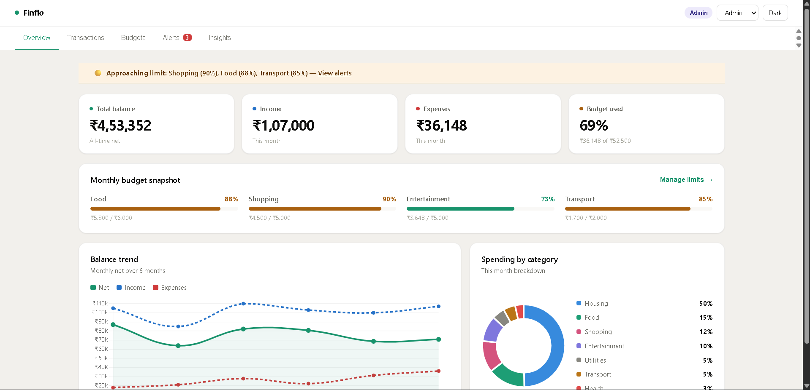

### 🌙 Dashboard Overview (Dark Mode)

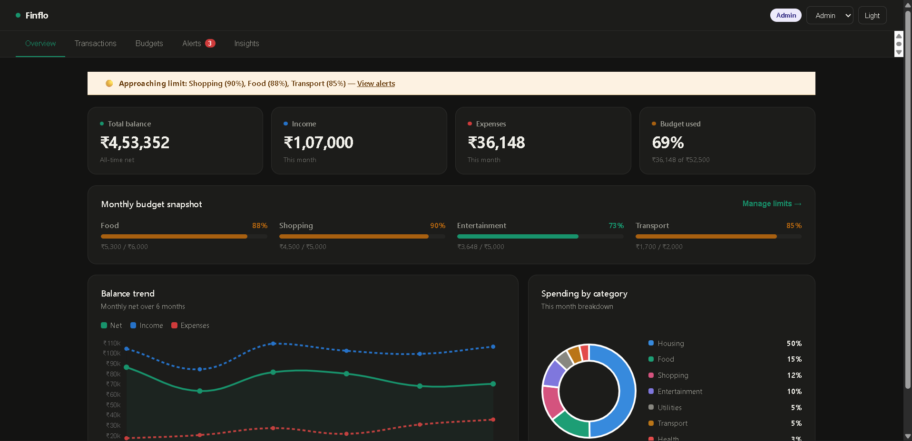

### 👤 Role-Based Access (Admin vs Viewer)

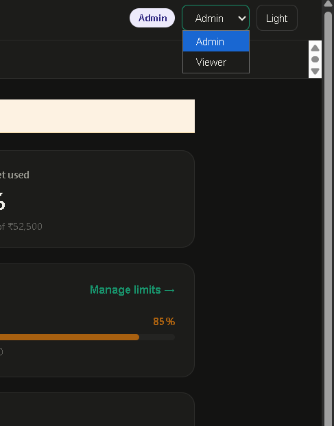

---

### 🚨 Smart Alerts System (Unique Feature)

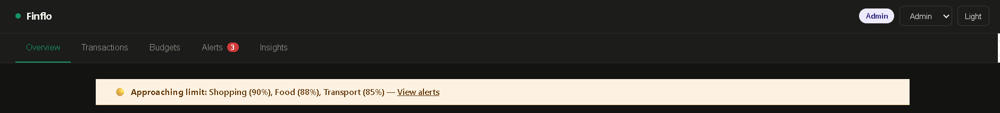

> Automatically notifies users when spending exceeds or approaches budget limits and redirects to the Alerts page.

---

### 📊 Financial Summary & Budget Snapshot

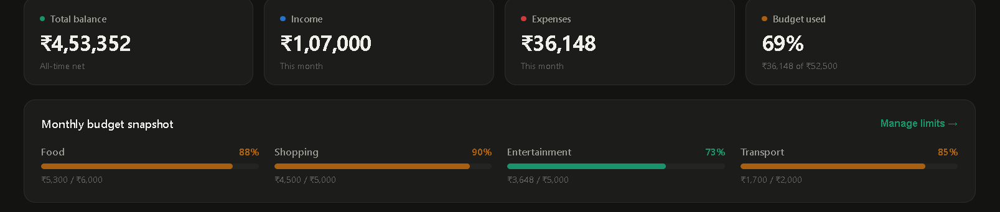

### 📈 Data Visualization (Charts for Insights)

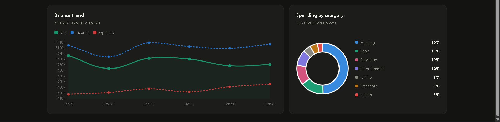

### 💳 Transactions Management

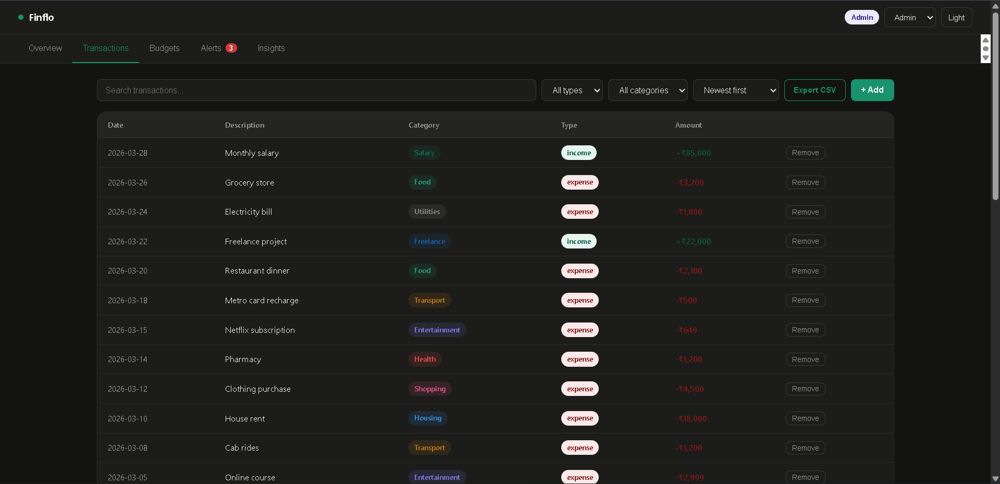

> Includes search, filtering, sorting, CSV export, and add transaction functionality (Admin only)

---

### 💰 Budget Management

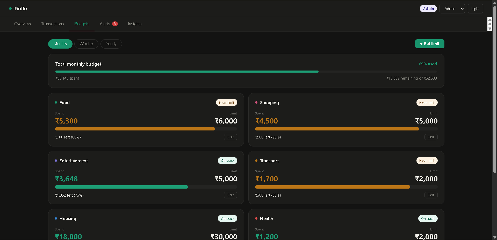

---

### ⭐ Core Highlight — Alerts Classification

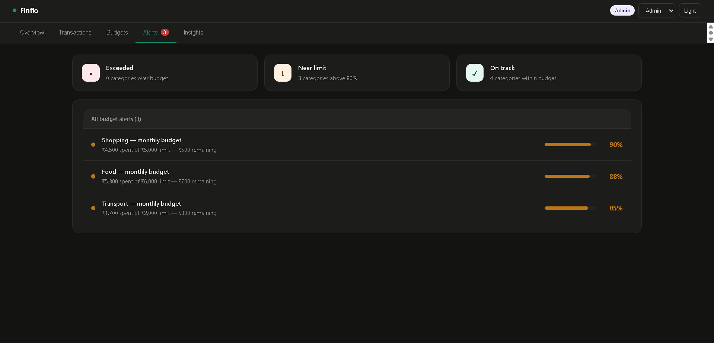

---

### 📈 Insights Section

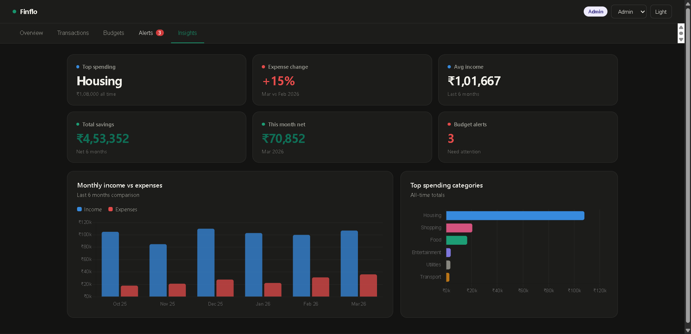

---

## 👀 Viewer Mode Screens

### 👤 Viewer Dashboard Access


### 📊 Viewer Transactions Access

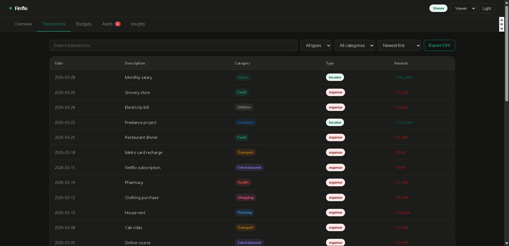

### 💰 Viewer Budget Access

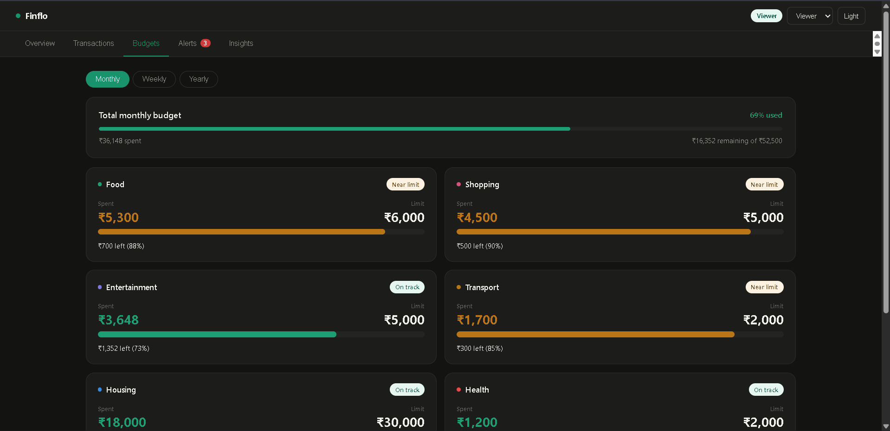

### 🚨 Viewer Alerts Access

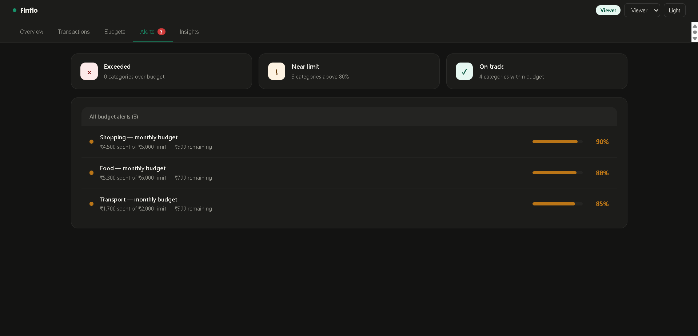

### 📈 Viewer Insights Access

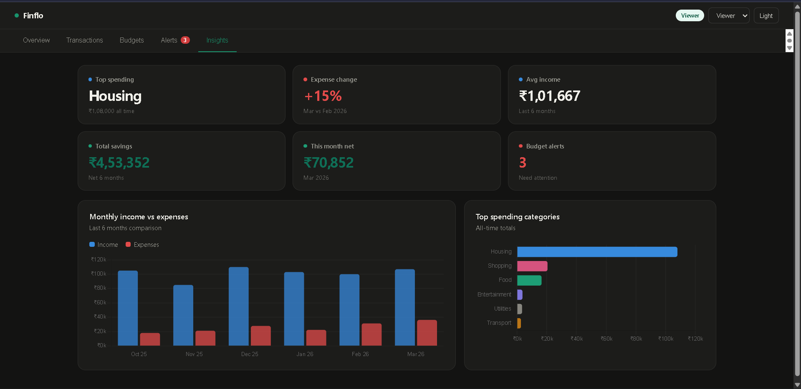

> In Viewer mode, users can only view data and export CSV. They cannot modify or add transactions.

---

## 🧠 My Approach

This project was built with a focus on:

* **Clarity over complexity** — Simple and intuitive UI
* **Modular design** — Breaking UI into reusable sections
* **Insight-driven experience** — Helping users understand financial data
* **Frontend-first thinking** — Simulating real-world scenarios without backend

The goal was to build a **practical, user-friendly financial dashboard** rather than an overly complex system.

---

## 🎯 Problem Statement

Users often struggle to:

* Track spending patterns
* Identify overspending
* Stay within budget

Finflo addresses this using **visual insights + structured data + smart alerts**.

---

## ✨ Key Features

### 📊 Dashboard Overview

* Total Balance, Income, Expenses
* Budget usage indicator
* Monthly trends (line chart)
* Spending breakdown (donut chart)
* Budget snapshot

---

### 💳 Transactions Management

* Transaction details (date, category, type, amount)
* 🔍 Search functionality
* 🎯 Filtering (type & category)
* ↕️ Sorting
* ➕ Add transactions (Admin)
* 📤 Export CSV

---

### 👤 Role-Based UI

* Roles: **Admin / Viewer**
* Admin: Full access (add/edit)
* Viewer: Read-only access
* Simulated using frontend logic

---

### 💰 Budget Management

* Category-wise budgets
* Visual progress tracking
* Status indicators:

  * ❌ Exceeded
  * ⚠️ Near limit
  * ✅ On track

---

## 🚨 ⭐ Unique Feature: Smart Alerts System

A dynamic alerting system that enhances financial awareness.

### 🔍 How it works:

* Monitors spending per category
* Classifies into:

| Status        | Condition         |
| ------------- | ----------------- |
| ❌ Exceeded    | Spending > Budget |
| ⚠️ Near Limit | ≥ ~80% of budget  |
| ✅ On Track    | Within safe range |

### 💡 Why this matters:

* Prevents overspending early
* Provides actionable insights
* Simulates real-world finance apps

---

## 🧰 Tech Stack

* **Frontend:** React.js
* **State Management:** Context API
* **Charts:** Recharts
* **Styling:** Custom CSS
* **Deployment:** Vercel

---

## 🧠 State Management

Handled using Context API for:

* Transactions
* Budgets
* Role selection
* Filters

Ensures centralized and consistent data flow.

---

## 📂 Project Structure

```bash
src/
├── components/
│   ├── Alerts.js
│   ├── Budgets.js
│   ├── Insights.js
│   ├── Overview.js
│   ├── Transactions.js
│
├── context/
│   ├── AppContext.js
│
├── data/
│   ├── mockData.js
│
├── App.js
├── App.css
├── index.js
```

---

## 🎨 UI/UX Principles

* Clean and minimal design
* Consistent color coding
* Visual hierarchy using cards & charts
* Instant feedback via alerts
* Easy navigation

---

## 📱 Responsiveness

Designed to work across different screen sizes with a focus on readability.

---

## 🌱 Future Improvements

* Backend integration
* Authentication
* Persistent storage
* Advanced analytics

---

## 📌 Final Note

This project demonstrates a **frontend-driven approach** to building a real-world financial dashboard with a focus on usability, insights, and proactive alerts.

---

## 👩‍💻 Author

**Dipali Kunwar**
Software Engineer in the Making 🚀

---
